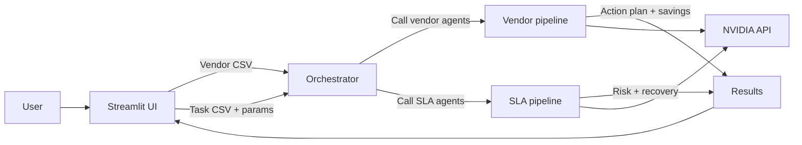
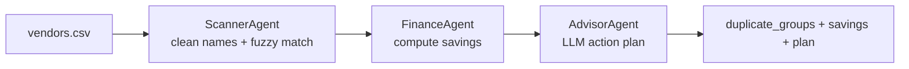
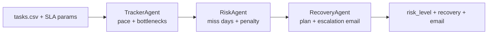

# 🛡️ ArthaRakshak — Enterprise Cost Intelligence System

> **"Artha"** (Sanskrit: अर्थ) = Wealth / Finance &nbsp;·&nbsp; **"Rakshak"** (Sanskrit: रक्षक) = Guardian / Protector  
> *Your AI guardian for enterprise financial health.*

---

<div align="center">


**ET AI Hackathon 2026 · Track 3 · Enterprise Cost Optimization**

</div>

---

## 📋 Table of Contents

1. [Overview](#-overview)
2. [Key Features](#-key-features)
3. [Project Architecture](#-project-architecture)
4. [Full System Flow](#-full-system-flow)
5. [Module 1 — Vendor Deduplication](#-module-1--vendor-deduplication-pipeline)
6. [Module 2 — SLA Risk Monitor](#-module-2--sla-risk-monitor-pipeline)
7. [Agent Reference](#-agent-reference)
8. [Tech Stack](#-tech-stack)
9. [Project Structure](#-project-structure)
10. [Installation & Setup](#-installation--setup)
11. [How to Use](#-how-to-use)
12. [CSV Formats](#-csv-input-formats)
13. [Configuration](#-configuration)

---

## 🌟 Overview

**ArthaRakshak** is a multi-agent AI system that protects enterprise finances on two fronts simultaneously:

| Module | What It Does | How It Works |
|--------|-------------|--------------|
| 🔍 **Vendor Deduplication** | Finds duplicate vendor entries causing silent budget leakage | Fuzzy name matching → savings calculation → AI action plan |
| ⏰ **SLA Risk Monitor** | Predicts SLA breach before it happens and quantifies penalty exposure | Pace tracking → risk math → AI recovery plan + escalation email |

Both modules share a single **Orchestrator** that coordinates specialized agents, logs every decision for audit, and routes AI calls through a unified NVIDIA LLM client.

---

## ✨ Key Features

- **Zero false-positive vendor matching** — strips business noise words (`Ltd`, `Pvt`, `Technologies`, `India`) before fuzzy comparison so `HCL Technologies` ≠ `Infosys Technologies`
- **Abbreviation-aware** — correctly matches `TCS` ↔ `Tata Consultancy Services` ↔ `TCS India Pvt Ltd`
- **Financial modelling** — calculates realistic 70% recovery rate on duplicate vendor spend
- **SLA breach prediction** — quantifies exact days of delay and rupee penalty at risk
- **AI-generated outputs** — NVIDIA LLaMA-3.1-70B writes the action plan, recovery roadmap, and escalation email
- **Full audit trail** — every agent decision is timestamped and displayed on the dashboard
- **Pluggable agents** — each agent is a standalone class; swap or extend without touching others

---

## 🏗️ Project Architecture

```
ArthaRakshak/
│
├── app.py                          # Streamlit UI — 3 tabs
├── .env                            # NVIDIA_API_KEY lives here
├── requirements.txt
│
├── agents/
│   ├── __init__.py
│   ├── orchestrator.py             # Master coordinator
│   │
│   ├── vendor/                     # Vendor Deduplication pipeline
│   │   ├── __init__.py
│   │   ├── scanner_agent.py        # Fuzzy duplicate detection
│   │   ├── finance_agent.py        # Savings calculation
│   │   └── advisor_agent.py        # NVIDIA LLM → action plan
│   │
│   └── sla/                        # SLA Risk Monitor pipeline
│       ├── __init__.py
│       ├── tracker_agent.py        # Pace & bottleneck tracking
│       ├── risk_agent.py           # Breach prediction & penalty math
│       └── recovery_agent.py       # NVIDIA LLM → plan + email
│
└── data/
    ├── sample_vendors.csv
    └── sample_tasks.csv
```

---

## 🔄 Full System Flow

The diagram below shows how the **entire application** works — from user upload to final output — across both modules.



---

## 🔍 Module 1 — Vendor Deduplication Pipeline

### What problem does it solve?

Large enterprises often onboard the same vendor multiple times under slightly different names — `"Wipro"`, `"Wipro Ltd"`, `"Wipro Limited"`, `"Wipro Technologies"` — across departments or over time. These duplicates cause **silent budget leakage** where you pay for overlapping services without realising it.

### Pipeline Flow



### The Name Cleaning Logic

This is the core innovation that eliminates false positives:

```
Input:  "Tata Consultancy Services Ltd"
Step 1: lowercase         → "tata consultancy services ltd"
Step 2: remove punctuation → "tata consultancy services ltd"
Step 3: remove NOISE_WORDS → "tata consultancy"   ✅

Input:  "HCL Technologies"
After cleaning           → "hcl"

Input:  "Infosys Technologies"
After cleaning           → "infosys"

fuzz.token_sort_ratio("hcl", "infosys") = 0  ← ✅ correctly NOT matched
fuzz.token_sort_ratio("tcs", "tata consultancy") = 88  ← ✅ correctly matched
```

**NOISE_WORDS removed:** `technologies · technology · corporation · corp · incorporated · inc · limited · ltd · pvt · private · india · solutions · services · consulting · group · global · international · enterprises · enterprise · company · co · llp · llc · and · the · of · & · systems · software · digital · tech · it`

### Savings Formula

```
total_group_spend  = sum of all vendor spends in the group
primary_spend      = the single largest spend (vendor to keep)
duplicate_spend    = total_group_spend - primary_spend
estimated_savings  = duplicate_spend × 0.70   (conservative 70% recovery)
```

---

## ⏰ Module 2 — SLA Risk Monitor Pipeline

### What problem does it solve?

Project teams often discover SLA breaches only after they've happened, by which time penalty clauses have already triggered. ArthaRakshak **predicts** the breach days in advance, calculates exact rupee exposure, surfaces blocked tasks, and gives the PM everything needed to either recover or escalate — before the deadline.

### Pipeline Flow



### Risk Calculation

```
days_needed           = tasks_remaining / current_rate
predicted_miss_days   = max(0,  days_needed - days_remaining)
financial_risk (Rs)   = predicted_miss_days × penalty_per_day

Risk Level:
  predicted_miss_days > 3  →  🔴 HIGH
  predicted_miss_days > 0  →  🟡 MEDIUM
  predicted_miss_days = 0  →  🟢 LOW
```

---

## 🤖 Agent Reference

### Orchestrator (`agents/orchestrator.py`)

| Responsibility | Detail |
|---|---|
| NVIDIA client | Creates **one** `OpenAI` client pointed at `https://integrate.api.nvidia.com/v1` |
| Routing | `run_vendor_analysis(df)` · `run_sla_analysis(df, tasks, days, penalty)` |
| Audit log | Appends `{timestamp, agent, action, detail}` after every agent step |
| Error boundary | Catches and surfaces exceptions without crashing the UI |

---

### ScannerAgent (`agents/vendor/scanner_agent.py`)

| Property | Value |
|---|---|
| AI used | ❌ None — pure Python |
| Algorithm | `rapidfuzz.fuzz.token_sort_ratio` on **cleaned** names |
| Similarity threshold | `85 / 100` |
| Key function | `_clean_name()` — strips noise words before comparison |
| Input | `pd.DataFrame` with `vendor_name` column |
| Output | `List[Dict]` — each dict is one duplicate group |

---

### FinanceAgent (`agents/vendor/finance_agent.py`)

| Property | Value |
|---|---|
| AI used | ❌ None — pure math |
| Recovery rate | `70%` of duplicate spend |
| Logic | Keep highest-spend vendor; treat all others as recoverable waste |
| Input | `List[Dict]` from ScannerAgent |
| Output | Same list, enriched with `total_group_spend · savings · duplicate_spend` |

---

### AdvisorAgent (`agents/vendor/advisor_agent.py`)

| Property | Value |
|---|---|
| AI used | ✅ NVIDIA LLaMA-3.1-70B |
| Temperature | `0.4` (professional, focused) |
| Max tokens | `900` |
| Input | Top-6 duplicate groups + total savings |
| Output | 3-section markdown action plan |
| Prompt style | Role-play as "senior enterprise cost optimization advisor" |

---

### TrackerAgent (`agents/sla/tracker_agent.py`)

| Property | Value |
|---|---|
| AI used | ❌ None — pure Python |
| Tracks | Completed · In Progress · Pending counts |
| Rate calculation | `tasks_completed / sum(days_elapsed)` from completed rows |
| Bottleneck detection | Rows where `blocker` column is non-null and non-empty |
| Input | `pd.DataFrame` + `contract_tasks` + `days_remaining` |
| Output | Tracking dict with rates, counts, bottlenecks, assignees |

---

### RiskAgent (`agents/sla/risk_agent.py`)

| Property | Value |
|---|---|
| AI used | ❌ None — deterministic math |
| Predicts | `predicted_miss_days` · `financial_risk` · `risk_level` |
| Safe default | If `current_rate == 0`, assumes `days_remaining + 10` days needed |
| Input | Tracking dict from TrackerAgent + `penalty_per_day` |
| Output | Risk dict (merges tracking dict + risk fields) |

---

### RecoveryAgent (`agents/sla/recovery_agent.py`)

| Property | Value |
|---|---|
| AI used | ✅ NVIDIA LLaMA-3.1-70B (called **twice**) |
| Call 1 | Recovery plan — 4 sections, specific to named assignees and blockers |
| Call 2 | Escalation email — under 200 words, professional, with clear ask |
| Temperature | `0.4` (plan) · `0.3` (email — more deterministic) |
| Max tokens | `900` (plan) · `500` (email) |

---

## 🛠️ Tech Stack

| Layer | Technology | Purpose |
|---|---|---|
| **UI** | Streamlit 1.43 | 3-tab web app, file uploads, metrics, charts |
| **Charts** | Plotly 5.19 | Bar charts, gauge chart for task completion |
| **LLM** | NVIDIA LLaMA-3.1-70B | Action plans, recovery plans, escalation emails |
| **LLM Client** | OpenAI SDK 1.30 | OpenAI-compatible client pointed at NVIDIA endpoint |
| **Fuzzy Match** | rapidfuzz 3.6 | `token_sort_ratio` for vendor name comparison |
| **Data** | pandas 2.2 | CSV ingestion, dataframe operations |
| **Config** | python-dotenv | `.env` file for API key management |
| **Excel** | openpyxl 3.1 | Optional Excel export support |

---

## 📁 Project Structure

```
ArthaRakshak/
│
├── 📄 app.py                       # Main Streamlit application
│   ├── Sidebar — API key input
│   ├── Tab 1 — Dashboard (metrics, bar chart, audit log)
│   ├── Tab 2 — Vendor Deduplication (upload, run, results)
│   └── Tab 3 — SLA Risk Monitor (upload, params, run, results)
│
├── 📄 .env                         # NVIDIA_API_KEY=your_key_here
├── 📄 requirements.txt
│
├── 📁 agents/
│   ├── 📄 __init__.py
│   ├── 📄 orchestrator.py          # Coordinator + audit log
│   │
│   ├── 📁 vendor/
│   │   ├── 📄 __init__.py
│   │   ├── 📄 scanner_agent.py     # Fuzzy dedup (no AI)
│   │   ├── 📄 finance_agent.py     # Savings math (no AI)
│   │   └── 📄 advisor_agent.py     # NVIDIA → action plan
│   │
│   └── 📁 sla/
│       ├── 📄 __init__.py
│       ├── 📄 tracker_agent.py     # Pace tracking (no AI)
│       ├── 📄 risk_agent.py        # Risk math (no AI)
│       └── 📄 recovery_agent.py    # NVIDIA → plan + email
│
└── 📁 data/
    ├── 📄 sample_vendors.csv       # Demo vendor data
    └── 📄 sample_tasks.csv         # Demo task tracker data
```

---

## ⚙️ Installation & Setup

### 1. Clone the repository

```bash
git clone https://github.com/your-org/artharakshak.git
cd artharakshak
```

### 2. Create and activate a virtual environment

```bash
python -m venv venv

# macOS / Linux
source venv/bin/activate

# Windows
venv\Scripts\activate
```

### 3. Install dependencies

```bash
pip install -r requirements.txt
```

### 4. Get your NVIDIA API key

1. Go to [build.nvidia.com](https://build.nvidia.com)
2. Sign up / log in → **API Catalog**
3. Click **Generate Key**
4. Copy the key

### 5. Configure the API key

**Option A — `.env` file (recommended):**

```bash
# Create .env in the project root
echo "NVIDIA_API_KEY=nvapi-xxxxxxxxxxxxxxxxxxxx" > .env
```

**Option B — paste directly in the sidebar** of the running app.

### 6. Run the application

```bash
streamlit run app.py
```

The app will open at `http://localhost:8501`

---

## 🚀 How to Use

### Vendor Deduplication

1. Open the **🔍 Vendor Deduplication** tab
2. Click **Browse files** → upload your `vendors.csv`
3. Review the loaded data in the preview table
4. Click **🔍 Run Vendor Deduplication Analysis**
5. View:
   - Total annual savings identified (in Rs)
   - Each duplicate group (expandable cards) with spend breakdown
   - AI-generated 3-section action plan
6. Switch to **📊 Dashboard** to see the savings bar chart and full audit log

### SLA Risk Monitor

1. Open the **⏰ SLA Risk Monitor** tab
2. Click **Browse files** → upload your `tasks.csv`
3. Set the three SLA parameters:
   - **Total tasks contracted** — number in your contract
   - **Days remaining** — calendar days until deadline
   - **Daily penalty (Rs)** — penalty clause value
4. Click **⚡ Assess SLA Risk**
5. View:
   - Risk level badge (🔴 HIGH / 🟡 MEDIUM / 🟢 LOW)
   - Completion gauge chart
   - Current vs required pace bar chart
   - Blocked tasks table
   - AI recovery plan (4 sections)
   - Ready-to-send escalation email

---

## 📊 CSV Input Formats

### vendors.csv

| Column | Type | Required | Description |
|--------|------|----------|-------------|
| `vendor_id` | string | ✅ | Unique identifier e.g. `V001` |
| `vendor_name` | string | ✅ | Name as it appears in invoices |
| `service_category` | string | ✅ | e.g. `IT Consulting`, `Cloud Services` |
| `annual_spend` | number | ✅ | Annual spend in Rupees |
| `contact_person` | string | ❌ | Optional — shown in tables |
| `contact_email` | string | ❌ | Optional |
| `payment_terms` | string | ❌ | e.g. `Net 30` |
| `region` | string | ❌ | e.g. `North`, `Pan India` |

**Sample row:**
```csv
vendor_id,vendor_name,service_category,annual_spend
V001,Wipro Technologies,Software Development,1200000
V002,Wipro Ltd,IT Consulting,450000
```

---

### tasks.csv (SLA Monitor)

| Column | Type | Required | Description |
|--------|------|----------|-------------|
| `task_id` | string | ✅ | Unique identifier e.g. `T001` |
| `task_name` | string | ✅ | Task description |
| `status` | string | ✅ | Must be `Completed`, `In Progress`, or `Pending` |
| `assigned_to` | string | ✅ | Team member name |
| `priority` | string | ❌ | `High`, `Medium`, `Low` |
| `blocker` | string | ❌ | Blank/`None` if unblocked; describe the blocker if stuck |
| `days_elapsed` | number | ❌ | Days taken (used for rate calculation on completed tasks) |

**Sample rows:**
```csv
task_id,task_name,status,assigned_to,priority,blocker,days_elapsed
T001,API Integration,Completed,Rahul Sharma,High,,2
T002,Database Migration,In Progress,Priya Verma,High,Waiting for DBA access,
T003,UI Testing,Pending,Amit Kumar,Medium,,
```

---

## 🔧 Configuration

### Similarity Threshold

In `agents/vendor/scanner_agent.py`:

```python
SIMILARITY_THRESHOLD = 85   # 0–100. Lower = more matches, higher = stricter
```

Recommended range: `80–90`. Below 75 starts producing false positives.

### Savings Recovery Rate

In `agents/vendor/finance_agent.py`:

```python
RECOVERY_RATE = 0.70   # 70% of duplicate spend is realistically recoverable
```

Adjust based on your industry's vendor contract exit terms.

### NVIDIA Model

In all AI agent files:

```python
NVIDIA_MODEL = "meta/llama-3.1-70b-instruct"
```

Other available models at [build.nvidia.com](https://build.nvidia.com/explore/discover):
- `meta/llama-3.1-405b-instruct` — highest quality, slower
- `mistralai/mixtral-8x22b-instruct-v0.1` — fast alternative
- `microsoft/phi-3-medium-128k-instruct` — lightweight option

---

## 📈 Example Outputs

### Vendor Deduplication Result

```
💰 Total Annual Savings Identified: Rs 18,45,000

Group 1: Wipro Technologies — Save Rs 3,15,000/year (3 duplicates)
  ├── Wipro Technologies  (Software Dev)     Rs 12,00,000
  ├── Wipro Ltd           (IT Consulting)    Rs  4,50,000
  └── Wipro               (Managed Services) Rs   50,000

Group 2: Salesforce — Save Rs 2,36,000/year (2 duplicates)
  ├── Salesforce Inc      (CRM Platform)     Rs 22,00,000
  └── Salesforce India    (CRM Software)     Rs  4,80,000
```

### SLA Risk Assessment Result

```
🔴 SLA RISK: HIGH

Tasks Completed : 12       Tasks Remaining : 28
Predicted Miss  : 6.5 days  Financial Risk  : Rs 3,25,000

Current pace  : 1.2 tasks/day
Required pace : 3.5 tasks/day  ← 3× faster needed
```

---

## 🔒 Security Notes

- The NVIDIA API key is never stored in session state beyond the current browser session
- `.env` is in `.gitignore` by default — never commit it
- All data processing happens locally; only the **prompt text** is sent to NVIDIA's API (no raw CSV data)

---

## 📄 License

MIT License — see `LICENSE` file for details.

---

## 🙏 Acknowledgements

- **NVIDIA** — LLaMA-3.1-70B inference via [build.nvidia.com](https://build.nvidia.com)
- **Meta AI** — LLaMA 3.1 model family
- **Streamlit** — rapid Python web app framework
- **rapidfuzz** — blazing-fast fuzzy string matching
- **ET AI Hackathon 2026** — for the problem statement inspiration

---

<div align="center">

Built for the **ET AI Hackathon 2026**

*ArthaRakshak — Because every rupee deserves a guardian.*

</div>
